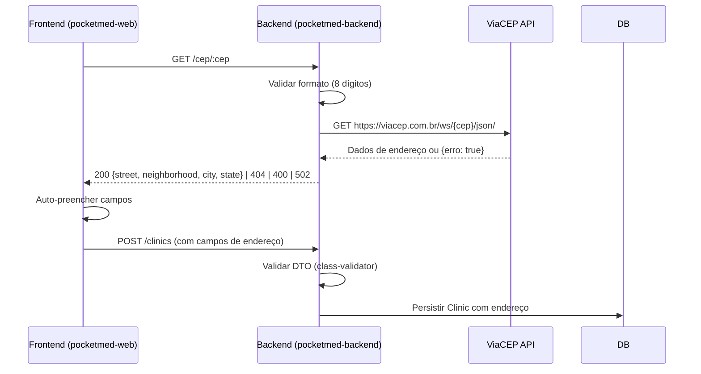

# Design Document: clinic-address-cep

## Overview

Este design descreve a implementação de campos de endereço com auto-preenchimento via CEP no formulário de criação de clínica. A solução envolve:

1. **Backend (pocketmed-backend)**: Novo módulo NestJS para consulta de CEP via ViaCEP API, alterações na entidade Clinic para persistir endereço, migration de banco, e validação nos DTOs de criação.
2. **Frontend (pocketmed-web)**: Campos de endereço no formulário de signup com auto-fill ao digitar CEP, checkbox "Sem Número", validação Formik/Yup e layout responsivo.

A arquitetura segue o padrão proxy: o frontend não acessa a API ViaCEP diretamente — o backend serve como intermediário, garantindo controle de erros, cache futuro e isolamento de dependências externas.

## Architecture



### Decisões Arquiteturais

| Decisão                          | Justificativa                                                                 |
| -------------------------------- | ----------------------------------------------------------------------------- |
| Proxy via backend                | Evita CORS, permite cache, centraliza tratamento de erros                     |
| Módulo `CepModule` separado      | Single Responsibility — reutilizável por outros contextos                     |
| `HttpModule` nativo do NestJS    | Não introduz dependências extras (usa Axios internamente via `@nestjs/axios`) |
| Campos na mesma tabela `clinics` | Relação 1:1, sem necessidade de tabela separada                               |
| Validação condicional (noNumber) | `class-validator` suporta validações condicionais com `@ValidateIf`           |

## Components and Interfaces

### Backend — Novo Módulo CEP

```
src/cep/
├── cep.module.ts          # Módulo com HttpModule
├── cep.controller.ts      # GET /cep/:cep
├── cep.service.ts         # Lógica de consulta ViaCEP
└── dto/
    └── cep-response.dto.ts # Interface de resposta
```

**CepController**:

```typescript
@Controller('cep')
export class CepController {
  @Public()
  @Get(':cep')
  async lookup(@Param('cep') cep: string): Promise<CepResponseDto>
}
```

**CepService**:

```typescript
@Injectable()
export class CepService {
  constructor(private readonly httpService: HttpService) {}

  async lookup(cep: string): Promise<CepResponseDto> {
    // 1. Validar formato (8 dígitos numéricos)
    // 2. Chamar ViaCEP
    // 3. Mapear resposta ou lançar exceção
  }
}
```

**CepResponseDto**:

```typescript
export class CepResponseDto {
  street: string; // logradouro
  neighborhood: string; // bairro
  city: string; // localidade
  state: string; // uf
}
```

### Backend — Alterações no Módulo Clinics

**Entidade Clinic** — novos campos:

```typescript
@Column({ type: 'varchar', length: 9, nullable: true })
cep: string | null;

@Column({ type: 'varchar', length: 255, nullable: true })
street: string | null;

@Column({ type: 'varchar', length: 20, nullable: true })
number: string | null;

@Column({ type: 'varchar', length: 255, nullable: true })
complement: string | null;

@Column({ type: 'varchar', length: 100, nullable: true })
neighborhood: string | null;

@Column({ type: 'varchar', length: 100, nullable: true })
city: string | null;

@Column({ type: 'varchar', length: 2, nullable: true })
state: string | null;

@Column({ type: 'boolean', default: false })
noNumber: boolean;
```

**CreateClinicDto** — novos campos com validação:

```typescript
@IsString()
@IsNotEmpty({ message: 'CEP é obrigatório' })
@Matches(/^\d{5}-?\d{3}$/, { message: 'CEP deve ter 8 dígitos (XXXXX-XXX ou XXXXXXXX)' })
cep: string;

@IsString()
@IsNotEmpty({ message: 'Endereço é obrigatório' })
@MaxLength(255)
street: string;

@ValidateIf((o) => !o.noNumber)
@IsString()
@IsNotEmpty({ message: 'Número é obrigatório quando "Sem Número" não está marcado' })
@MaxLength(20)
number?: string;

@IsOptional()
@IsString()
@MaxLength(255)
complement?: string;

@IsString()
@IsNotEmpty({ message: 'Bairro é obrigatório' })
@MaxLength(100)
neighborhood: string;

@IsString()
@IsNotEmpty({ message: 'Cidade é obrigatória' })
@MaxLength(100)
city: string;

@IsString()
@IsNotEmpty({ message: 'Estado é obrigatório' })
@MaxLength(2)
state: string;

@IsOptional()
@IsBoolean()
noNumber?: boolean;
```

### Frontend — Campos no Formulário

**Componentes afetados**:

- `Signup.tsx` — Formulário de criação de clínica
- Schema Yup estendido com validações condicionais
- Hook ou função para chamada ao endpoint `/cep/:cep`

**Fluxo de auto-preenchimento**:

1. Usuário digita CEP (8 dígitos)
2. `useEffect` ou `onChange` detecta 8 dígitos
3. Chama `GET /cep/{cep}` no backend
4. Se sucesso: preenche `street`, `neighborhood`, `city`, `state`
5. Se erro 404: exibe mensagem informativa, mantém campos editáveis
6. Se erro 502/rede: exibe mensagem informativa, mantém campos editáveis

## Data Models

### Tabela `clinics` — Colunas Adicionadas

| Coluna       | Tipo         | Nullable | Default | Descrição                 |
| ------------ | ------------ | -------- | ------- | ------------------------- |
| cep          | VARCHAR(9)   | YES      | NULL    | CEP formatado (XXXXX-XXX) |
| street       | VARCHAR(255) | YES      | NULL    | Logradouro                |
| number       | VARCHAR(20)  | YES      | NULL    | Número                    |
| complement   | VARCHAR(255) | YES      | NULL    | Complemento               |
| neighborhood | VARCHAR(100) | YES      | NULL    | Bairro                    |
| city         | VARCHAR(100) | YES      | NULL    | Cidade                    |
| state        | VARCHAR(2)   | YES      | NULL    | UF (sigla)                |
| noNumber     | TINYINT(1)   | NO       | 0       | Flag sem número           |

> **Nota**: Colunas nullable para compatibilidade retroativa com clínicas já existentes que não possuem endereço preenchido.

### ViaCEP API Response (referência)

```json
{
  "cep": "01001-000",
  "logradouro": "Praça da Sé",
  "complemento": "lado ímpar",
  "unidade": "",
  "bairro": "Sé",
  "localidade": "São Paulo",
  "uf": "SP",
  "estado": "São Paulo",
  "regiao": "Sudeste",
  "ibge": "3550308",
  "gia": "1004",
  "ddd": "11",
  "siafi": "7107"
}
```

### Migration

```typescript
// src/database/migrations/1788000000000-AddAddressFieldsToClinics.ts
export class AddAddressFieldsToClinics1788000000000 implements MigrationInterface {
  public async up(queryRunner: QueryRunner): Promise<void> {
    await queryRunner.query(`
      ALTER TABLE \`clinics\`
      ADD COLUMN \`cep\` varchar(9) NULL,
      ADD COLUMN \`street\` varchar(255) NULL,
      ADD COLUMN \`number\` varchar(20) NULL,
      ADD COLUMN \`complement\` varchar(255) NULL,
      ADD COLUMN \`neighborhood\` varchar(100) NULL,
      ADD COLUMN \`city\` varchar(100) NULL,
      ADD COLUMN \`state\` varchar(2) NULL,
      ADD COLUMN \`noNumber\` tinyint NOT NULL DEFAULT 0;
    `);
  }

  public async down(queryRunner: QueryRunner): Promise<void> {
    await queryRunner.query(`
      ALTER TABLE \`clinics\`
      DROP COLUMN \`noNumber\`,
      DROP COLUMN \`state\`,
      DROP COLUMN \`city\`,
      DROP COLUMN \`neighborhood\`,
      DROP COLUMN \`complement\`,
      DROP COLUMN \`number\`,
      DROP COLUMN \`street\`,
      DROP COLUMN \`cep\`;
    `);
  }
}
```

## Correctness Properties

_A property is a characteristic or behavior that should hold true across all valid executions of a system — essentially, a formal statement about what the system should do. Properties serve as the bridge between human-readable specifications and machine-verifiable correctness guarantees._

### Property 1: ViaCEP response mapping preserves all address fields

_For any_ valid ViaCEP response object containing logradouro, bairro, localidade, and uf, the CepService mapping SHALL produce a CepResponseDto where street equals logradouro, neighborhood equals bairro, city equals localidade, and state equals uf.

**Validates: Requirements 1.1, 1.2**

### Property 2: Invalid CEP format rejection at endpoint

_For any_ string that does not consist of exactly 8 numeric digits, the CepService lookup SHALL reject the input with a 400 BadRequest error.

**Validates: Requirements 1.4**

### Property 3: Conditional number validation based on noNumber flag

_For any_ valid CreateClinicDto, if noNumber is true then number may be empty/null/undefined and validation SHALL pass; if noNumber is false or absent then number being empty/null/undefined SHALL cause validation to fail.

**Validates: Requirements 2.2, 2.3, 3.3, 3.4**

### Property 4: Required address fields and CEP format in DTO validation

_For any_ CreateClinicDto where at least one of (cep, street, neighborhood, city, state) is empty or missing, OR where cep does not match the format of 8 numeric digits (with optional hyphen XXXXX-XXX), validation SHALL reject the request.

**Validates: Requirements 3.1, 3.2, 3.5**

### Property 5: Frontend auto-fill populates all address fields from CEP response

_For any_ valid CepResponseDto returned by the backend (containing street, neighborhood, city, state), the form auto-fill mechanism SHALL set each corresponding form field to the value from the response, resulting in all 4 fields being non-empty.

**Validates: Requirements 4.3**

### Property 6: Frontend validation shows individual error for each missing required field

_For any_ non-empty subset of required address fields (cep, street, number, neighborhood, city, state) that are left empty in the form, submitting SHALL produce at least one visible error message for each empty field in that subset.

**Validates: Requirements 7.1, 7.2**

## Error Handling

### Backend — CepService

| Cenário                                            | Status HTTP     | Resposta                                                             |
| -------------------------------------------------- | --------------- | -------------------------------------------------------------------- |
| CEP com formato inválido                           | 400 Bad Request | `{ message: "CEP deve conter exatamente 8 dígitos numéricos" }`      |
| CEP não encontrado (ViaCEP retorna `{erro: true}`) | 404 Not Found   | `{ message: "CEP não encontrado" }`                                  |
| ViaCEP indisponível / timeout / erro de rede       | 502 Bad Gateway | `{ message: "Falha ao consultar serviço de CEP. Tente novamente." }` |
| CEP válido com resposta                            | 200 OK          | `{ street, neighborhood, city, state }`                              |

### Backend — Clinic Creation (validação DTO)

| Cenário                       | Status HTTP     | Resposta                                                                   |
| ----------------------------- | --------------- | -------------------------------------------------------------------------- |
| Campo obrigatório ausente     | 400 Bad Request | `{ message: [...mensagens class-validator] }`                              |
| CEP formato inválido no DTO   | 400 Bad Request | `{ message: "CEP deve ter 8 dígitos (XXXXX-XXX ou XXXXXXXX)" }`            |
| noNumber=false e number vazio | 400 Bad Request | `{ message: "Número é obrigatório quando 'Sem Número' não está marcado" }` |

### Frontend — Tratamento de Erros

| Cenário                                   | Comportamento                                                                                  |
| ----------------------------------------- | ---------------------------------------------------------------------------------------------- |
| CEP endpoint retorna 404                  | Exibe alerta informativo: "CEP não encontrado. Preencha o endereço manualmente."               |
| CEP endpoint retorna 502 ou falha de rede | Exibe alerta informativo: "Não foi possível consultar o CEP. Preencha o endereço manualmente." |
| Timeout na requisição de CEP              | Trata como erro de rede (mesmo comportamento do 502)                                           |
| Validação Yup falha                       | Exibe mensagem inline em cada campo com erro                                                   |

### Timeout e Resiliência

- Timeout para chamada ViaCEP: **5 segundos**
- Sem retry automático — em caso de falha, o usuário preenche manualmente
- O endpoint de CEP é público (`@Public()`) — não requer autenticação

## Testing Strategy

### Abordagem Dual: Unit Tests + Property Tests

**Unit Tests (Jest)**:

- Cenários específicos do CepService (CEP encontrado, não encontrado, erro de rede)
- Integração do CepController com validação de parâmetros
- Validação de DTO com class-validator (cenários de borda)
- Criação de clínica com campos de endereço (fluxo completo)

**Property-Based Tests (fast-check + Jest)**:

- Biblioteca: `fast-check` (já compatível com o ecossistema Jest do projeto)
- Mínimo 100 iterações por propriedade
- Cada teste referencia a propriedade do design document

**Tag format**: `Feature: clinic-address-cep, Property {number}: {property_text}`

### Plano de Testes

| Camada          | Tipo     | Ferramenta                   | Foco                                                            |
| --------------- | -------- | ---------------------------- | --------------------------------------------------------------- |
| CepService      | Property | fast-check + Jest            | Mapeamento ViaCEP → DTO (P1), rejeição de formato inválido (P2) |
| CreateClinicDto | Property | fast-check + Jest            | Validação condicional noNumber (P3), campos obrigatórios (P4)   |
| CepController   | Unit     | Jest + supertest             | Endpoints com mocks, status codes                               |
| ClinicsService  | Unit     | Jest                         | Criação com endereço, transação                                 |
| Migration       | Smoke    | Jest                         | Verifica que migration executa sem erro                         |
| Frontend form   | Property | fast-check + Testing Library | Auto-fill (P5), validação per-field (P6)                        |
| Frontend form   | Unit     | Testing Library              | Checkbox behavior, loading state, error messages                |

### Configuração fast-check

```typescript
// Exemplo de configuração
fc.assert(
  fc.property(arbValidViaCepResponse(), (response) => {
    const result = mapViaCepResponse(response);
    expect(result.street).toBe(response.logradouro);
    expect(result.neighborhood).toBe(response.bairro);
    expect(result.city).toBe(response.localidade);
    expect(result.state).toBe(response.uf);
  }),
  { numRuns: 100 },
);
```
