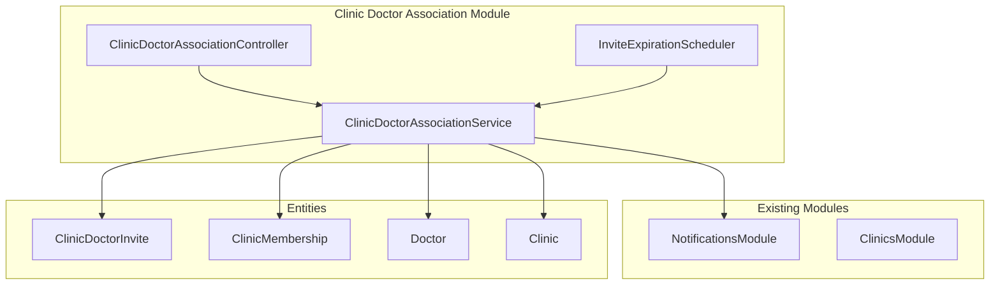
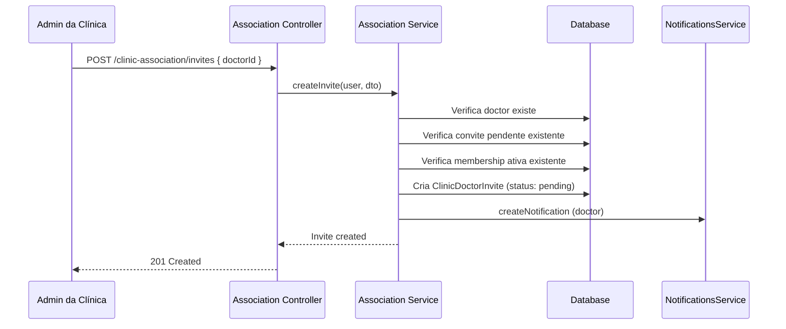
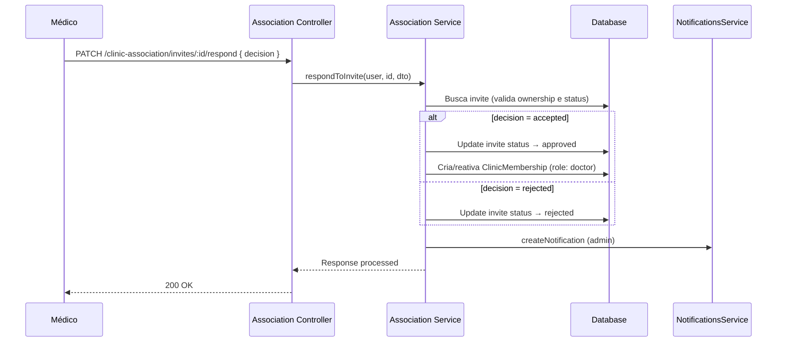

# Design Document: Clinic-Doctor Association

## Overview

Este design descreve a implementação do sistema de associação entre clínicas e médicos na plataforma PocketMed. A funcionalidade segue o padrão de solicitação/aprovação já existente no sistema (similar ao `DoctorAccessRequest` para médico-paciente), adaptado para o contexto clínica-médico.

O fluxo principal é:

1. Admin da clínica pesquisa médico por CRM/estado
2. Admin envia convite ao médico
3. Médico aceita ou rejeita o convite
4. Se aceito, uma `ClinicMembership` é criada/reativada
5. Qualquer parte pode encerrar a associação

### Decisões de Design

- **Reutilização da entidade `ClinicMembership`**: A entidade já possui os campos necessários (`clinicId`, `professionalId`, `role`, `isActive`, `invitedBy`). Não será necessário criar nova entidade para a associação em si.
- **Nova entidade `ClinicDoctorInvite`**: Para rastrear o ciclo de vida dos convites (pending, approved, rejected, cancelled, expired), similar à `DoctorAccessRequest`.
- **Módulo dedicado `clinic-doctor-association`**: Separa a lógica de convites e associação da lógica de criação/gestão de clínicas existente no `ClinicsModule`.
- **Scheduled task para expiração**: Um cron job verifica convites pendentes com mais de 30 dias e os marca como expirados.
- **Banco MySQL**: O projeto utiliza MySQL (via TypeORM), não PostgreSQL conforme mencionado — confirmado pelo `app.module.ts`.

## Architecture



### Fluxo de Convite



### Fluxo de Resposta



## Components and Interfaces

### 1. ClinicDoctorAssociationController

Responsável pelos endpoints REST da feature.

```typescript
@Controller('clinic-association')
export class ClinicDoctorAssociationController {
  // === Convites (Admin) ===
  @Post('invites')                           // Criar convite
  @Get('invites/sent')                       // Listar convites enviados pela clínica
  @Patch('invites/:id/cancel')               // Cancelar convite pendente

  // === Convites (Médico) ===
  @Get('invites/received')                   // Listar convites recebidos
  @Patch('invites/:id/respond')              // Aceitar/rejeitar convite

  // === Memberships ===
  @Get('memberships/my-clinics')             // Listar clínicas do médico
  @Delete('memberships/:id')                 // Médico sai da clínica
  @Delete('memberships/:id/remove')          // Admin remove médico

  // === Pesquisa ===
  @Get('doctors/search')                     // Pesquisa médico por CRM + estado

  // === Dashboard ===
  @Get('dashboard')                          // Dashboard consolidado da clínica
  @Get('dashboard/doctors/:doctorId/patients') // Pacientes de um médico na clínica
}
```

### 2. ClinicDoctorAssociationService

Lógica de negócio principal.

```typescript
@Injectable()
export class ClinicDoctorAssociationService {
  // Convites
  createInvite(user: AuthUser, dto: CreateInviteDto): Promise<ClinicDoctorInvite>;
  respondToInvite(user: AuthUser, inviteId: string, dto: RespondInviteDto): Promise<void>;
  cancelInvite(user: AuthUser, inviteId: string): Promise<void>;
  getReceivedInvites(doctorId: string): Promise<ClinicDoctorInvite[]>;
  getSentInvites(clinicId: string): Promise<ClinicDoctorInvite[]>;
  expirePendingInvites(): Promise<number>;

  // Memberships
  removeMember(user: AuthUser, membershipId: string): Promise<void>;
  leaveClinic(user: AuthUser, membershipId: string): Promise<void>;
  getMyClinics(doctorId: string): Promise<ClinicMembership[]>;

  // Pesquisa
  searchDoctorByCrm(crm: string, state: string): Promise<DoctorSearchResult>;

  // Dashboard
  getClinicDashboard(clinicId: string): Promise<DashboardResponse>;
  getDoctorPatients(clinicId: string, doctorId: string): Promise<PatientListItem[]>;
}
```

### 3. InviteExpirationScheduler

Scheduled task para expirar convites antigos.

```typescript
@Injectable()
export class InviteExpirationScheduler {
  @Cron(CronExpression.EVERY_DAY_AT_2AM)
  handleExpiration(): Promise<void>
}
```

### 4. DTOs

```typescript
// Input DTOs
class CreateInviteDto {
  doctorId: string;
}
class RespondInviteDto {
  decision: 'accepted' | 'rejected';
}
class SearchDoctorDto {
  crm: string;
  state: string;
}

// Response DTOs (tipagem dos retornos)
interface DoctorSearchResult {
  id;
  name;
  specialty;
  crm;
  profileImage;
}
interface DashboardResponse {
  doctors: DashboardDoctorItem[];
}
interface DashboardDoctorItem {
  id;
  name;
  specialty;
  patientCount;
}
interface PatientListItem {
  id;
  name;
}
```

## Data Models

### Nova Entidade: ClinicDoctorInvite

```typescript
@Entity('clinic_doctor_invites')
export class ClinicDoctorInvite {
  @PrimaryGeneratedColumn('uuid')
  id: string;

  @Column({ type: 'uuid' })
  clinicId: string;

  @Column({ type: 'uuid' })
  doctorId: string;

  @Column({ type: 'uuid' })
  invitedBy: string; // Admin que enviou o convite

  @Column({
    type: 'enum',
    enum: ['pending', 'approved', 'rejected', 'cancelled', 'expired'],
    default: 'pending',
  })
  status: 'pending' | 'approved' | 'rejected' | 'cancelled' | 'expired';

  @ManyToOne(() => Clinic)
  @JoinColumn({ name: 'clinicId' })
  clinic: Clinic;

  @ManyToOne(() => Doctor)
  @JoinColumn({ name: 'doctorId' })
  doctor: Doctor;

  @ManyToOne(() => Doctor)
  @JoinColumn({ name: 'invitedBy' })
  inviter: Doctor;

  @CreateDateColumn()
  createdAt: Date;

  @UpdateDateColumn()
  updatedAt: Date;
}
```

### Entidade Existente: ClinicMembership (sem alterações)

A entidade `ClinicMembership` já possui todos os campos necessários:

- `clinicId` + `professionalId` com unique constraint
- `role` (admin | doctor | secretary)
- `isActive` (boolean para soft-delete)
- `invitedBy` (UUID do admin que convidou)

### Migration

A migration criará:

1. Tabela `clinic_doctor_invites` com as colunas descritas
2. Índice composto em `(clinicId, doctorId, status)` para busca rápida de convites pendentes
3. Índice em `doctorId` para listagem de convites recebidos
4. Foreign keys para `clinics`, `doctors`

```sql
CREATE TABLE clinic_doctor_invites (
  id CHAR(36) PRIMARY KEY,
  clinicId CHAR(36) NOT NULL,
  doctorId CHAR(36) NOT NULL,
  invitedBy CHAR(36) NOT NULL,
  status ENUM('pending','approved','rejected','cancelled','expired') DEFAULT 'pending',
  createdAt TIMESTAMP DEFAULT CURRENT_TIMESTAMP,
  updatedAt TIMESTAMP DEFAULT CURRENT_TIMESTAMP ON UPDATE CURRENT_TIMESTAMP,
  CONSTRAINT FK_invite_clinic FOREIGN KEY (clinicId) REFERENCES clinics(id) ON DELETE CASCADE,
  CONSTRAINT FK_invite_doctor FOREIGN KEY (doctorId) REFERENCES doctors(id) ON DELETE CASCADE,
  CONSTRAINT FK_invite_inviter FOREIGN KEY (invitedBy) REFERENCES doctors(id) ON DELETE CASCADE,
  INDEX IDX_invite_clinic_doctor_status (clinicId, doctorId, status),
  INDEX IDX_invite_doctor (doctorId)
);
```

## Correctness Properties

_A property is a characteristic or behavior that should hold true across all valid executions of a system — essentially, a formal statement about what the system should do. Properties serve as the bridge between human-readable specifications and machine-verifiable correctness guarantees._

### Property 1: Invite creation produces correct record

_For any_ valid admin context (with activeClinicId) and any existing doctor UUID, creating an invite SHALL produce a `ClinicDoctorInvite` with status "pending", the admin's clinicId as `clinicId`, the target doctor's UUID as `doctorId`, and the admin's UUID as `invitedBy`.

**Validates: Requirements 1.1**

### Property 2: Invite preconditions prevent invalid creation

_For any_ clinic-doctor pair where either (a) a pending invite already exists for the same pair, or (b) an active membership already exists for the same pair, attempting to create a new invite SHALL be rejected with an appropriate error.

**Validates: Requirements 1.2, 1.3**

### Property 3: Invite expiration targets only eligible invites

_For any_ set of `ClinicDoctorInvite` records with varying statuses and creation dates, running the expiration process SHALL change the status to "expired" only for invites where `status = 'pending'` AND `createdAt` is more than 30 days ago. All other invites SHALL remain unchanged.

**Validates: Requirements 1.6**

### Property 4: Acceptance of a pending invite produces an active membership

_For any_ pending invite, when the target doctor accepts it, the invite status SHALL become "approved" and a `ClinicMembership` SHALL exist with `clinicId` matching the invite, `professionalId` matching the doctor, `role = 'doctor'`, and `isActive = true`. If an inactive membership already existed for the same pair, it SHALL be reactivated rather than duplicated.

**Validates: Requirements 2.1, 2.2**

### Property 5: Rejection of a pending invite produces no membership

_For any_ pending invite, when the target doctor rejects it, the invite status SHALL become "rejected" and no `ClinicMembership` SHALL be created or modified for that clinic-doctor pair.

**Validates: Requirements 2.3**

### Property 6: Only pending invites accept responses

_For any_ invite with status in ['approved', 'rejected', 'cancelled', 'expired'], attempting to respond with any decision SHALL be rejected with a 400 error.

**Validates: Requirements 2.5**

### Property 7: Only valid decisions are accepted

_For any_ string value that is not exactly "accepted" or "rejected", submitting it as the decision for a pending invite SHALL be rejected with a 400 error.

**Validates: Requirements 2.7**

### Property 8: Invite listing returns complete and ordered results

_For any_ set of invites associated with a doctor (received) or a clinic (sent), querying the respective list SHALL return all matching invites ordered by `createdAt` descending, with no omissions or duplicates.

**Validates: Requirements 3.1, 3.2**

### Property 9: Multi-clinic limit enforcement

_For any_ doctor who already has 20 active `ClinicMembership` records, attempting to create a 21st active membership (via invite acceptance) SHALL be rejected. For any doctor with fewer than 20, acceptance SHALL succeed.

**Validates: Requirements 4.1**

### Property 10: Doctor clinic listing returns complete and ordered memberships

_For any_ set of active `ClinicMembership` records for a doctor, querying the doctor's clinics SHALL return all active memberships ordered by `createdAt` ascending, with no omissions.

**Validates: Requirements 4.2**

### Property 11: Data projection restricts exposed fields by role

_For any_ doctor record in a clinic, when queried by an admin, the response SHALL contain only the fields [name, email, specialty, crm] and SHALL NOT contain [cpf, phone, birthDate, password]. When queried by a secretary for patients, the response SHALL contain only [id, name, email] and linked doctors.

**Validates: Requirements 5.1, 5.5**

### Property 12: Doctor patient visibility restricted to own active permissions

_For any_ doctor with an active clinic membership, querying patients SHALL return only patients where a `DoctorPermission` exists with `doctorId` matching the requesting doctor and `isActive = true`, or patients created by the doctor as shadow patients. Patients linked to other doctors SHALL NOT appear.

**Validates: Requirements 5.2**

### Property 13: Dashboard excludes clinical data

_For any_ dashboard response, the returned data SHALL contain only aggregated information (doctor names, specialties, patient counts, patient names) and SHALL NOT contain any clinical fields (appointments, exams, medications, prescriptions, exam results).

**Validates: Requirements 5.3**

### Property 14: Membership deactivation sets isActive to false

_For any_ active `ClinicMembership`, when deactivated by either the admin or the doctor themselves, `isActive` SHALL become `false`. The record SHALL NOT be deleted from the database (soft-delete).

**Validates: Requirements 6.1, 6.2**

### Property 15: CRM search normalization handles both stored formats

_For any_ CRM number (1-10 digits) and valid state (2-letter UF), the search SHALL find the doctor regardless of whether the CRM is stored as "ESTADO-NUMERO" or "NUMERO/ESTADO". The normalization SHALL produce equivalent matches for both formats.

**Validates: Requirements 7.1, 7.3**

### Property 16: Dashboard doctor list is alphabetically ordered

_For any_ set of doctors with role "doctor" and active membership in a clinic, the dashboard SHALL return them sorted alphabetically by name (case-insensitive).

**Validates: Requirements 8.1**

### Property 17: Dashboard patient count reflects only active direct permissions

_For any_ doctor in a clinic, the patient count displayed on the dashboard SHALL equal the number of `DoctorPermission` records where `doctorId` matches, `isActive = true`, and `patientId` is not null. Records with only `dependentId` SHALL NOT be counted separately.

**Validates: Requirements 8.3**

## Error Handling

### HTTP Error Codes

| Scenario                                       | Code | Message                                                         |
| ---------------------------------------------- | ---- | --------------------------------------------------------------- |
| Médico não encontrado (convite)                | 404  | "Médico não encontrado"                                         |
| Convite pendente já existe                     | 409  | "Já existe uma solicitação pendente para este médico"           |
| Médico já associado                            | 409  | "O médico já está associado à clínica"                          |
| Solicitação já respondida                      | 400  | "Esta solicitação já foi respondida"                            |
| Acesso negado (invite de outra clínica/médico) | 403  | "Acesso negado"                                                 |
| Decisão inválida                               | 400  | "Valor de decisão inválido. Use 'accepted' ou 'rejected'"       |
| Solicitação não pendente (cancelamento)        | 400  | "Somente solicitações pendentes podem ser canceladas"           |
| Limite de 20 clínicas atingido                 | 422  | "Limite máximo de 20 clínicas atingido"                         |
| Último admin não pode sair                     | 422  | "O último administrador ativo não pode ser removido da clínica" |
| Médico sem permissão admin para remoção        | 403  | "Acesso negado por falta de permissão administrativa"           |
| Associação já inativa                          | 400  | "A associação já se encontra inativa"                           |
| Associação não encontrada                      | 404  | "Associação não encontrada"                                     |
| CRM/Estado obrigatórios                        | 400  | "CRM e Estado são obrigatórios"                                 |
| Médico não encontrado (pesquisa CRM)           | 404  | "Nenhum médico encontrado com o CRM informado"                  |
| Falha ao carregar dashboard                    | 500  | "Indisponibilidade temporária ao carregar dados"                |

### Tratamento de Erros por Camada

1. **Controller**: Validação de DTOs via `class-validator` + pipes do NestJS. Erros de validação retornam 400 automaticamente.
2. **Service**: Business logic errors lançam exceções tipadas (`ConflictException`, `NotFoundException`, `ForbiddenException`, `BadRequestException`, `UnprocessableEntityException`).
3. **Repository/DB**: Constraint violations (unique index) são capturadas e convertidas em respostas amigáveis no service.
4. **Scheduler**: Erros no cron job são logados mas não propagados ao usuário. Tentativas subsequentes reprocessam automaticamente.

### Transactions

- **Aceitar convite**: Operação transacional (atualizar invite + criar/reativar membership) para garantir consistência.
- **Criar convite + notificação**: Notificação enviada após commit do invite (falha na notificação não reverte o convite).

## Testing Strategy

### Abordagem Dual: Unit Tests + Property-Based Tests

O projeto já possui `fast-check` (^4.9.0) e `jest` (^29.7.0) configurados. A estratégia combina:

1. **Property-Based Tests (fast-check)**: Validam as 17 propriedades de corretude listadas acima. Cada property test executa no mínimo 100 iterações com inputs gerados aleatoriamente.

2. **Unit Tests (jest)**: Cobrem cenários específicos, edge cases, e integrações com mocks.

3. **Integration Tests (supertest)**: Validam o fluxo completo HTTP → Controller → Service → DB para cenários-chave.

### Configuração dos Property Tests

- **Biblioteca**: `fast-check` (já instalado)
- **Iterações mínimas**: 100 por property
- **Tag format**: `Feature: clinic-doctor-association, Property {N}: {description}`
- **Localização**: `src/clinic-doctor-association/__tests__/properties/`

### Estrutura de Testes

```
src/clinic-doctor-association/
├── __tests__/
│   ├── properties/
│   │   ├── invite-creation.property.spec.ts    (Properties 1, 2, 3)
│   │   ├── invite-response.property.spec.ts    (Properties 4, 5, 6, 7)
│   │   ├── invite-listing.property.spec.ts     (Properties 8, 10)
│   │   ├── membership.property.spec.ts         (Properties 9, 14)
│   │   ├── data-projection.property.spec.ts    (Properties 11, 12, 13)
│   │   ├── crm-search.property.spec.ts         (Property 15)
│   │   └── dashboard.property.spec.ts          (Properties 16, 17)
│   ├── clinic-doctor-association.service.spec.ts
│   └── clinic-doctor-association.controller.spec.ts
```

### Generators (fast-check arbitraries)

Para os property tests, definir generators reutilizáveis:

- `arbDoctorId()`: UUID v4 aleatório
- `arbClinicId()`: UUID v4 aleatório
- `arbCrmNumber()`: String de 1-10 dígitos numéricos
- `arbState()`: UF válida (2 letras de um set fixo de 27 estados)
- `arbCrmStored()`: CRM em formato "ESTADO-NUMERO" ou "NUMERO/ESTADO"
- `arbInviteStatus()`: Um dos 5 status válidos
- `arbNonPendingStatus()`: Status excluindo "pending"
- `arbInvalidDecision()`: String aleatória que não é "accepted" nem "rejected"
- `arbDoctorName()`: Nome aleatório para ordenação

### Unit Tests — Cenários Prioritários

- Convite: doctor não existe → 404
- Convite: admin tenta convidar a si mesmo (se aplicável)
- Resposta: doctor tenta responder invite de outro → 403
- Cancelamento: admin de outra clínica → 403
- Remoção: último admin → 422
- Remoção: doctor sem role admin tenta remover outro → 403
- Desativação: membership já inativa → 400
- Pesquisa CRM: campos vazios → 400
- Dashboard: clínica sem médicos → mensagem adequada
- Dashboard: falha de DB → 500
